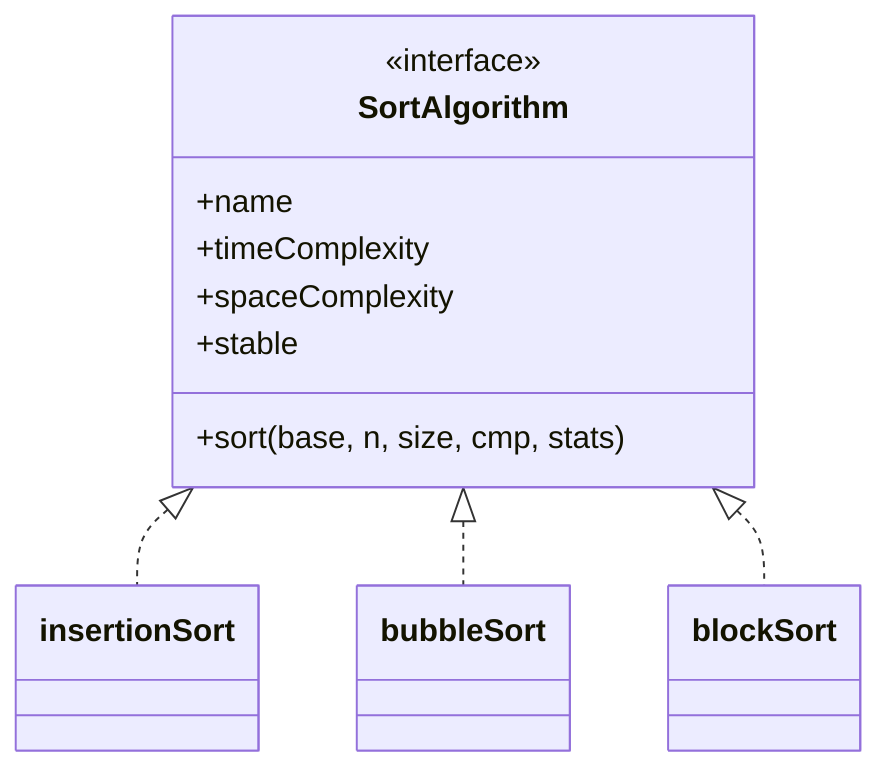
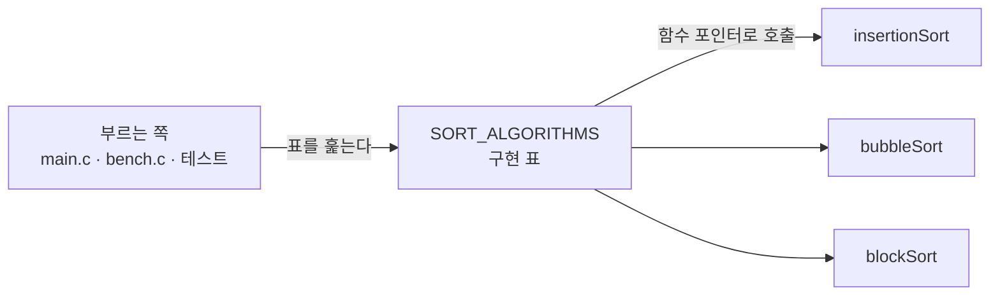
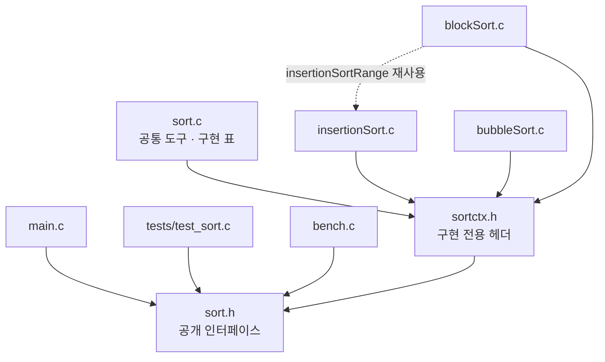
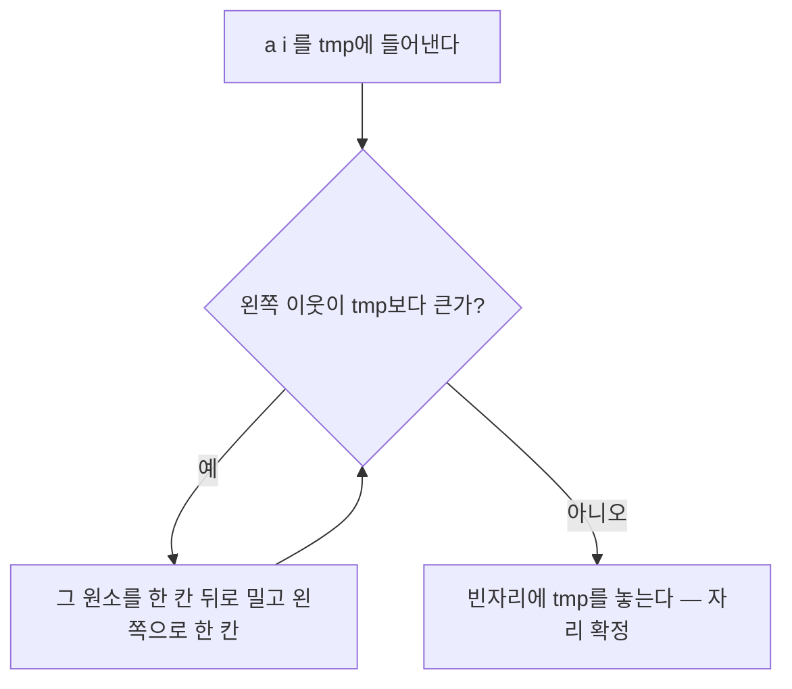
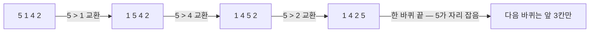
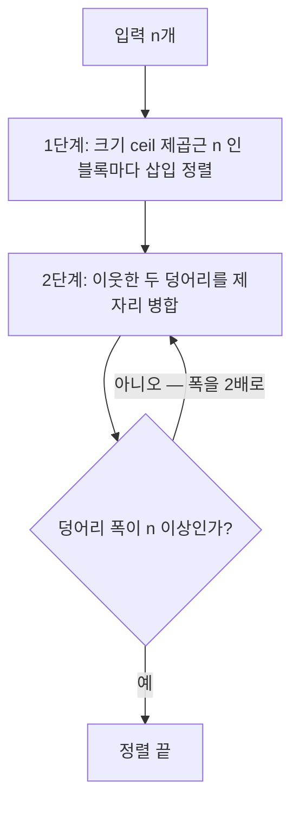
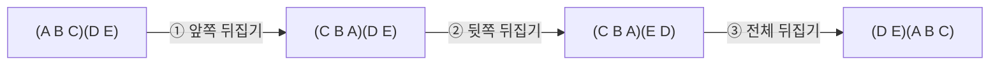
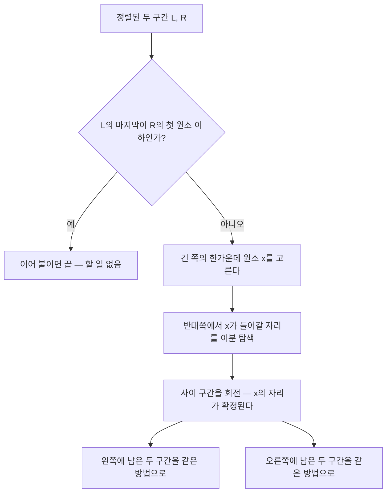
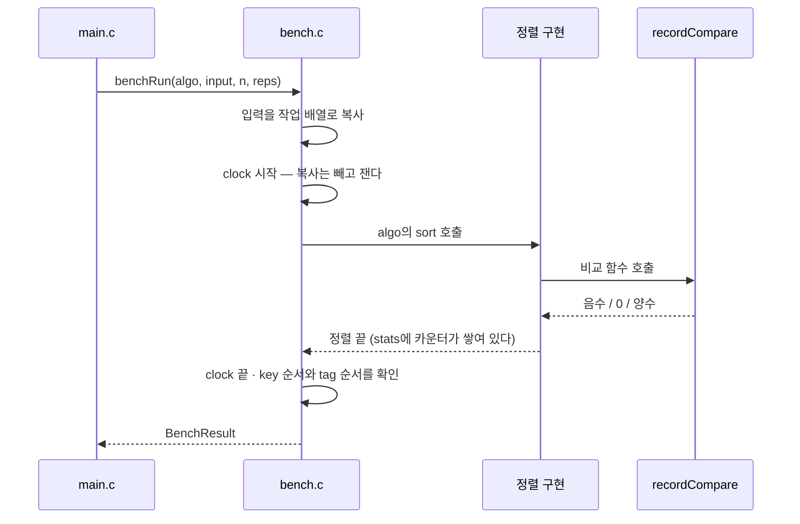
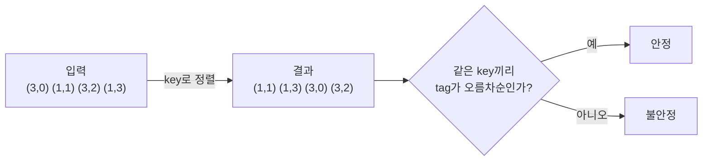

# 정렬 비교 보고서 — 삽입 · 버블 · 블록

세 가지 정렬을 **하나의 공통 인터페이스**로 묶고, 같은 잣대로 속도 · 메모리 ·
안정성을 잰 결과다.

- 구현: [`src/insertionSort.c`](src/insertionSort.c) ·
  [`src/bubbleSort.c`](src/bubbleSort.c) · [`src/blockSort.c`](src/blockSort.c)
- 실행: `make run` (비교 표) · `make test` (유닛 테스트 42개)
- 환경: 컨테이너 안 `gcc -std=c17 -Wall -Wextra -O2`

---

## 1. 왜 인터페이스부터 만들었나

정렬 셋을 각각 따로 부르면 비교 코드가 셋으로 갈라진다. 측정 조건이 조금씩
어긋나면 비교 자체를 믿을 수 없다. 그래서 **부르는 쪽이 정렬 이름을 한 번도
적지 않게** 만드는 것을 먼저 했다.

C에는 `interface`도 클래스도 없다. 대신 **함수 포인터를 담은 구조체**를 쓴다.
C++의 가상 함수 테이블이 실제로 이 모양이다.

```c
/* src/sort.h */
typedef int (*SortCompare)(const void *a, const void *b);   /* qsort와 같은 규약 */

typedef struct SortAlgorithm {
    const char *name;
    const char *timeComplexity;
    const char *spaceComplexity;
    int stable;                  /* 안정 정렬이라고 "주장"하는 값 */
    void (*sort)(void *base, size_t n, size_t size,
                 SortCompare cmp, SortStats *stats);
} SortAlgorithm;

extern const SortAlgorithm SORT_ALGORITHMS[];   /* 구현 목록 */
```



자바라면 `implements` 한 줄이었을 것이 여기서는 **표에 한 줄 넣는 것**이다.

```c
/* src/sort.c */
const SortAlgorithm SORT_ALGORITHMS[] = {
    {"insertionSort", "O(n^2)",       "O(1)", 1, insertionSort},
    {"bubbleSort",    "O(n^2)",       "O(1)", 1, bubbleSort},
    {"blockSort",     "O(n log^2 n)", "O(1)", 1, blockSort},
};
```

부르는 쪽은 이 표만 훑는다.



얻은 것이 셋 있다.

1. **측정 조건이 하나로 고정된다.** 같은 입력, 같은 복사, 같은 시계.
2. **테스트가 저절로 따라온다.** 유닛 테스트도 표를 훑으므로, 정렬을 하나 더
   넣으면 그 순간부터 같은 검사를 받는다.
3. **원소 타입에서 풀려난다.** 비교를 `qsort` 규약의 함수 포인터로 받으므로
   정렬이 원소를 모른다. 이게 단순한 멋이 아니라 **안정성 측정의 전제**다
   (→ [5절](#5-안정성은-어떻게-쟀나)).

### 인터페이스 설계에서 고른 것

| 고민 | 고른 것 | 이유 |
| --- | --- | --- |
| 원소 타입 | `void *base` + `size_t size` | `qsort`와 같은 모양. `int` 전용이면 안정성을 못 잰다 |
| 비교 | 함수 포인터 | 정렬을 고치지 않고 정렬 기준만 바꿀 수 있다 |
| 측정값 | `SortStats *` 인자 | 전역 변수를 쓰면 정렬을 겹쳐 부를 수 없다. `NULL`이면 측정 안 함 |
| 시간 | **인터페이스 밖**에서 잰다 | 정렬이 자기 시계를 들면 측정이 구현마다 달라진다 |

---

## 2. 파일 구조

정렬 셋은 작업 문맥(원소 크기 · 비교 함수 · 카운터)을 공유한다. 이것을
`sort.h`에 두면 `main.c`까지 정렬의 내장을 보게 되므로, **구현 전용 헤더**를
따로 두어 갈랐다.



| 파일 | 맡은 것 |
| --- | --- |
| `sort.h` | 바깥에 보이는 인터페이스 (`SortAlgorithm`, `SortStats`, `SortCompare`) |
| `sortctx.h` | `SortCtx`와 `sortSwap` 등 구현끼리만 쓰는 도구 |
| `sort.c` | 그 도구의 구현 + `SORT_ALGORITHMS` 표 |
| `insertionSort.c` · `bubbleSort.c` · `blockSort.c` | 알고리즘 하나씩 |
| `bench.c` | 시간 · 안정성 측정 (알고리즘은 자기가 측정당하는 줄 모른다) |

`sortctx.h`에 드러난 이름은 파일 밖에서도 보이므로 `sortSwap`,
`sortCompareAt`처럼 `sort-`를 붙였다. 한 파일에서만 쓰는
`rotateRange`·`mergeInPlace` 같은 것은 `static`으로 감췄다.

### 공통 도구

세 구현이 똑같이 쓰는 것은 `SortCtx` 하나로 묶었다.

```c
/* src/sortctx.h */
typedef struct SortCtx {
    char *base;        /* 배열의 첫 바이트 */
    size_t size;       /* 원소 한 개의 바이트 수 */
    SortCompare cmp;
    SortStats *stats;
    char *tmp;         /* 원소 한 칸. 추가로 잡는 메모리는 이것뿐이다 */
} SortCtx;
```

원소 타입을 모르므로 교환도 바이트 단위다. `sortSwap` 한 번이 **이동 3회**이고,
이 숫자가 뒤 결과표에서 버블 정렬을 무겁게 만든다.

---

## 3. 세 알고리즘

### 3.1 삽입 정렬

앞쪽을 정렬된 상태로 유지하며 원소를 하나씩 끼워 넣는다.



핵심은 조건이 `>`라는 것이다. **같은 값을 만나면 넘지 않고 멈춘다.** 이 한
글자가 안정성을 만든다.

```c
while (j > lo && sortCompareTmp(c, j - 1) > 0) {   /* '>=' 이면 불안정해진다 */
    sortMove(c, sortElemAt(c, j), sortElemAt(c, j - 1));
    j--;
}
```

시작 부분에 `이미 제자리면 건너뛴다` 검사를 두었다. 덕분에 정렬된 입력에서는
비교 `n-1`번, 이동 0번으로 끝난다(결과표의 `[정렬됨]` 행).

### 3.2 버블 정렬

이웃한 두 원소를 견주며 큰 값을 뒤로 밀어낸다.



한 바퀴 동안 교환이 하나도 없으면 멈춘다. 그래서 정렬된 입력은 삽입 정렬과
똑같이 `n-1`번 비교로 끝난다.

비교 횟수는 삽입 정렬과 비슷한데 **이동이 3배 가까이 많다.** 삽입 정렬은 한 칸씩
밀어내므로 이동 1회지만, 버블 정렬의 교환은 `tmp`를 거쳐 이동 3회이기 때문이다.
셋 중 가장 느린 이유가 이것이다.

### 3.3 블록 정렬

작은 블록으로 잘라 각각 정렬한 뒤, 덩어리를 배로 넓혀 가며 병합한다.



병합 정렬과 다른 점은 **보조 배열을 쓰지 않는다**는 것이다. 대신 원소 덩어리를
**회전(rotation)** 으로 통째로 옮긴다. 회전은 뒤집기 세 번이면 된다.



추가 메모리가 필요 없어서, 이 회전이 제자리 병합의 유일한 도구다.

제자리 병합은 이렇게 돈다.



**안정성은 이분 탐색을 무엇으로 하느냐에 달렸다.**

| 한가운데를 고른 쪽 | 쓰는 탐색 | 왜 |
| --- | --- | --- |
| 왼쪽 구간 | `lowerBound` (그 값 **이상**이 처음 나오는 자리) | 오른쪽의 같은 값은 뒤에 남아야 한다 |
| 오른쪽 구간 | `upperBound` (그 값 **초과**가 처음 나오는 자리) | 왼쪽의 같은 값은 앞에 남아야 한다 |

둘을 바꿔 쓰면 정렬 결과는 멀쩡한데 안정성만 조용히 깨진다. 유닛 테스트가
이것을 잡는다.

> **이 구현은 수업용으로 줄인 판이다.** 실제 block sort(WikiSort)는 배열 안에
> 내부 버퍼를 잡아 병합을 `O(n log n)`까지 끌어내린다. 여기서는 회전 병합만
> 써서 `O(n log^2 n)`이다. 대신 200줄이 아니라 파일 하나로 읽힌다.

---

## 4. 무엇을 어떻게 쟀나



| 재는 것 | 방법 | 주의 |
| --- | --- | --- |
| 시간 | `clock()`, 복사를 뺀 구간, `reps`회 평균 | 기계 · 부하에 흔들린다. **같은 표 안에서만** 견줄 것 |
| 비교 · 이동 | 구현이 `SortStats`에 센다 | 재현된다. 보고서에는 이쪽이 더 믿을 만하다 |
| 메모리 | `extraBytes` — 입력 배열 밖에 잡은 최대 바이트 | 셋 다 `tmp` 한 칸뿐이다 |
| 재귀 깊이 | `maxDepth` — 실제로 들어간 최대 깊이 | 스택 사용량의 대리 지표 |
| 안정성 | `tag` 순서 실측 | 표의 `stable` 값은 **주장**일 뿐이다 |

입력은 네 모양으로 만든다: 무작위 · 정렬됨 · 역순 · 중복많음. 씨앗을 고정해
매번 같은 입력을 쓴다.

---

## 5. 안정성은 어떻게 쟀나

`int` 배열로는 안정성을 볼 수 없다. `3`과 `3`은 구별되지 않기 때문이다. 그래서
원소를 두 칸짜리로 만들었다.

```c
/* src/bench.h */
typedef struct Record {
    int key;   /* 정렬 기준 */
    int tag;   /* 입력에서의 순서를 새겨 둔다 */
} Record;
```

`recordCompare`는 **`key`만** 본다(`tag`까지 넣으면 모든 정렬이 안정해 보인다).
정렬이 끝난 뒤 같은 `key`끼리 `tag`가 오름차순이면 안정 정렬이다.



이것이 가능한 이유는 인터페이스가 `void *`와 비교 함수를 받기 때문이다. 정렬
코드는 `Record`를 전혀 모르는 채로 정렬한다.

유닛 테스트는 실측 결과가 **구현 표의 `stable` 값과 일치하는지**를 본다. 표에
`stable`이라 적어 두고 구현이 안 지키면 실패한다.

실제로 삽입 정렬의 `>`를 `>=`로 한 글자만 바꿔 보면 검사 **6개**가 무너진다.
삽입 정렬에서 3개, **블록 정렬에서 3개**다. 블록 정렬이 블록을 정리할 때 같은
`insertionSortRange`를 쓰기 때문이다. 이때도 결과는 여전히 오름차순으로
정렬되어 있다 — 안정성 검사가 없었다면 아무도 눈치채지 못했을 것이다.

---

## 6. 결과

`make run`의 출력이다. 같은 컨테이너, `-O2`.

### 6.1 입력 모양별 (n = 4,000, 3회 평균)

| 입력 | 알고리즘 | 시간(ms) | 비교 | 이동 | 재귀깊이 |
| --- | --- | ---: | ---: | ---: | ---: |
| 무작위 | insertionSort | 9.934 | 3,950,647 | 3,950,655 | 1 |
| 무작위 | bubbleSort | 27.889 | 7,997,922 | 11,828,007 | 1 |
| 무작위 | **blockSort** | **0.723** | **115,971** | 352,201 | 16 |
| 정렬됨 | insertionSort | 0.003 | 3,999 | 0 | 1 |
| 정렬됨 | bubbleSort | 0.005 | 3,999 | 0 | 1 |
| 정렬됨 | blockSort | 0.004 | 3,999 | 0 | 1 |
| 역순 | insertionSort | 19.897 | 8,001,999 | 8,005,998 | 1 |
| 역순 | bubbleSort | 29.415 | 7,998,000 | 23,994,000 | 1 |
| 역순 | **blockSort** | **0.517** | **133,851** | 311,166 | 24 |
| 중복많음 | insertionSort | 8.910 | 3,575,497 | 3,575,032 | 1 |
| 중복많음 | bubbleSort | 26.277 | 7,867,695 | 10,703,898 | 1 |
| 중복많음 | **blockSort** | **0.421** | **74,499** | 238,678 | 21 |

읽을 것 네 가지.

- **정렬된 입력에서는 셋이 똑같다.** 비교 `n-1`번, 이동 0번. 조기 종료가
  셋 다 걸린다.
- **역순은 O(n^2) 둘의 최악이다.** 삽입 정렬의 비교가 `8,001,999 ≈ n^2/2`로
  이론값과 맞는다.
- **버블 정렬의 이동이 역순에서 23,994,000 = 비교 수의 3배.** 매 비교가 교환으로
  이어지고, 교환 하나가 이동 3회이기 때문이다. 시간이 삽입 정렬의 1.5배인 이유.
- **블록 정렬은 입력 모양에 거의 흔들리지 않는다.** 중복이 많으면 오히려
  빨라진다(조기 종료가 더 자주 걸린다).

### 6.2 n을 키우며 (무작위)

| n | insertion 비교 | 배수 | bubble 비교 | 배수 | block 비교 | 배수 |
| ---: | ---: | ---: | ---: | ---: | ---: | ---: |
| 1,000 | 255,273 | — | 499,094 | — | 18,762 | — |
| 2,000 | 998,714 | ×3.91 | 1,998,945 | ×4.00 | 45,915 | ×2.45 |
| 4,000 | 3,950,647 | ×3.96 | 7,997,922 | ×4.00 | 115,971 | ×2.53 |
| 8,000 | 15,966,683 | ×4.04 | 31,982,470 | ×4.00 | 289,630 | ×2.50 |

| n | insertion(ms) | bubble(ms) | block(ms) |
| ---: | ---: | ---: | ---: |
| 1,000 | 0.636 | 1.636 | 0.129 |
| 2,000 | 2.449 | 6.684 | 0.290 |
| 4,000 | 9.609 | 27.526 | 0.712 |
| 8,000 | 38.624 | 116.624 | **1.797** |

- `n`이 2배가 되면 삽입 · 버블은 **4배**. 정의 그대로 `O(n^2)`다.
- 블록 정렬은 **약 2.5배**. `n log n`이면 2.2배쯤이어야 하니, 조금 가파른 것이
  `log^2` 항의 값이다.
- `n = 8,000`에서 블록 정렬은 버블 정렬의 **65배** 빠르다. 그리고 `n`이 커질수록
  이 격차는 더 벌어진다.

### 6.3 메모리와 안정성

| 알고리즘 | 추가 메모리 | 재귀 깊이 (n=8,000) | 안정성(실측) |
| --- | ---: | ---: | :---: |
| insertionSort | 8 B | 1 | 안정 |
| bubbleSort | 8 B | 1 | 안정 |
| blockSort | 8 B | 17 | 안정 |

**셋 다 8바이트로 같다.** 원소 한 칸(`Record` 하나)이 전부다. 이게 밋밋한 결과로
보이지만, 사실 이 표의 결론이다.

- 일반적인 병합 정렬이었다면 `O(n)` = 64,000바이트가 들었을 자리다.
- 블록 정렬은 **그 8바이트를 지킨 채** 비교 횟수를 `O(n^2)`에서 끌어내렸다.
  이것이 블록 정렬의 존재 이유다.
- 공짜는 아니다. 값을 치른 곳이 **재귀 깊이** 열이다. 깊이 17이면 스택 프레임
  17개를 쓴다. `O(1)`이라고 할 때 스택은 세지 않았다는 뜻이기도 하다.

---

## 7. 검증

```console
$ make test
...
42 checks, 0 failures
```

정렬마다 같은 검사를 돌린다(표를 훑으므로 자동이다).

| 검사 | 내용 |
| --- | --- |
| 기본 케이스 | 섞임 · 정렬됨 · 역순 · 중복 · 모두 같은 값 · 원소 1개 · 빈 배열 |
| `qsort` 대조 | 난수 500개를 표준 라이브러리 결과와 맞춰 본다 |
| 크기 훑기 | `n = 0..200` 전부. 2의 거듭제곱이 아닌 크기에서 블록 · 병합 경계가 깨지기 쉽다 |
| 안정성 | `tag` 순서 실측이 구현 표의 `stable` 값과 일치하는지 |
| 측정 도구 | `makeInput`이 만든 입력 모양, 안정성 판정기가 위반을 잡는지 |

이와 별도로 **ASan · UBSan**을 붙여 돌려 경고가 없음을 확인했다. 바이트 단위
포인터 산술을 쓰므로 이 확인이 필요하다.

```sh
gcc -std=c17 -Wall -Wextra -g -O1 -fsanitize=address,undefined -Isrc \
    -o asan.out tests/test_sort.c src/sort.c src/insertionSort.c \
    src/bubbleSort.c src/blockSort.c src/bench.c && ./asan.out
```

---

## 8. 한계

- **블록 정렬이 줄인 판이다.** 내부 버퍼를 쓰지 않아 `O(n log^2 n)`이다. 진짜
  `O(n log n)`을 보려면 WikiSort를 봐야 한다.
- **`O(1)` 메모리에 스택은 안 세었다.** 제자리 병합의 재귀가 `O(log n)` 깊이다.
  반복문과 명시적 스택으로 바꾸면 그 몫까지 `extraBytes`로 잴 수 있다.
- **시간은 기계 하나에서 잰 값이다.** 다른 기계 · 다른 최적화 수준에서는 달라진다.
  비교 · 이동 횟수를 함께 보는 이유다.
- **`rand()`로 입력을 만든다.** 씨앗은 고정했지만 분포는 표준 라이브러리에
  맡겼다.
- 셋 다 안정 정렬이라 **불안정한 정렬과의 대조가 없다.** 선택 정렬이나 퀵
  정렬을 표에 한 줄 더 넣으면 `stable` 열이 비로소 갈린다.
