# 정렬 비교 보고서 — 삽입 · 버블 · 블록

세 가지 정렬을 **하나의 공통 인터페이스**로 묶고, 같은 잣대로 속도 · 메모리 ·
안정성을 잰 결과다.

- 구현: [`src/insertionSort.c`](../src/insertionSort.c) ·
  [`src/bubbleSort.c`](../src/bubbleSort.c) · [`src/blockSort.c`](../src/blockSort.c)
- 실행: `make run` (비교 표) · `make test` (유닛 테스트 42개)
- 환경: 컨테이너 안 `gcc -std=c17 -Wall -Wextra -O2`

---

## 차례

1. [코드 보고서](#1-코드-보고서) — 무엇을 어떻게 만들었나
2. [알고리즘 상세](#2-알고리즘-상세) — 세 정렬이 실제로 어떻게 도나
3. [알고리즘 실험](#3-알고리즘-실험) — 같은 잣대로 재고 견준 결과

---

## 1. 코드 보고서

설계에서 고른 것과 그 근거, 파일 구성, 그리고 그것이 맞는지 확인한 방법.

### 1.1 왜 인터페이스부터 만들었나

정렬 셋을 각각 따로 부르면 비교 코드가 셋으로 갈라진다. 측정 조건이 조금씩
어긋나면 비교 자체를 믿을 수 없다. 그래서 **부르는 쪽이 정렬 이름을 한 번도
적지 않게** 만드는 것을 먼저 했다.

C에는 `interface`도 클래스도 없다. 대신 **함수 포인터를 담은 구조체**를 쓴다.
C++의 가상 함수 테이블이 실제로 이 모양이다.

```c
/* src/sort.h */
typedef int (*SortCompare)(const void *a, const void *b);   /* qsort와 같은 규약 */

typedef struct SortAlgorithm {
    const char *name;
    const char *timeComplexity;
    const char *spaceComplexity;
    int stable;                  /* 안정 정렬이라고 "주장"하는 값 */
    void (*sort)(void *base, size_t n, size_t size,
                 SortCompare cmp, SortStats *stats);
} SortAlgorithm;

extern const SortAlgorithm SORT_ALGORITHMS[];   /* 구현 목록 */
```

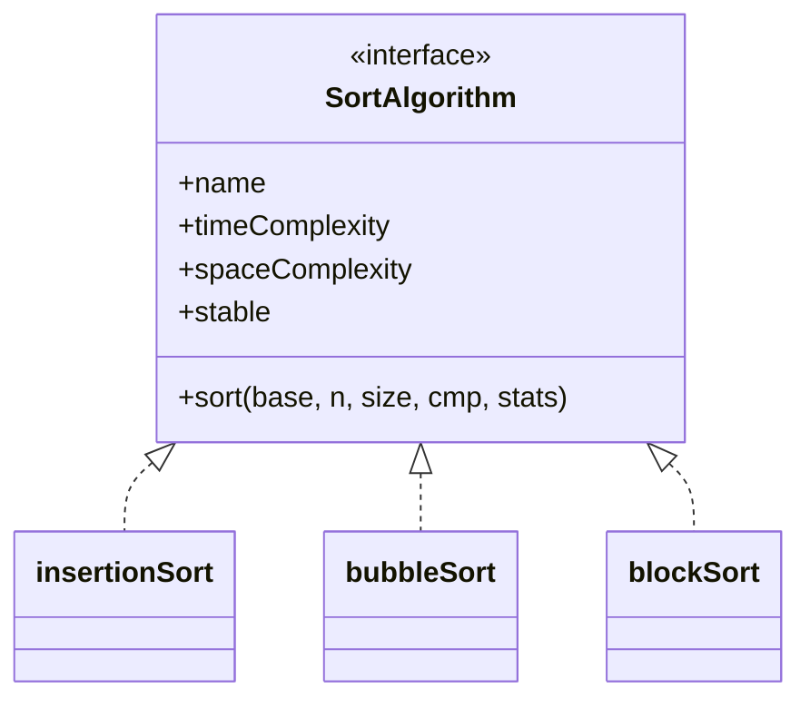

자바라면 `implements` 한 줄이었을 것이 여기서는 **표에 한 줄 넣는 것**이다.

```c
/* src/sort.c */
const SortAlgorithm SORT_ALGORITHMS[] = {
    {"insertionSort", "O(n^2)",       "O(1)", 1, insertionSort},
    {"bubbleSort",    "O(n^2)",       "O(1)", 1, bubbleSort},
    {"blockSort",     "O(n log^2 n)", "O(1)", 1, blockSort},
};
```

부르는 쪽은 이 표만 훑는다.

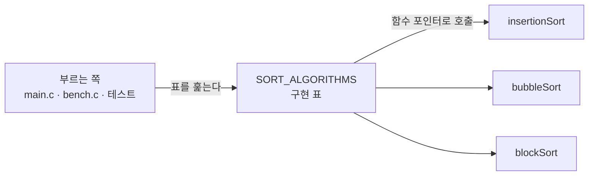

얻은 것이 셋 있다.

1. **측정 조건이 하나로 고정된다.** 같은 입력, 같은 복사, 같은 시계.
2. **테스트가 저절로 따라온다.** 유닛 테스트도 표를 훑으므로, 정렬을 하나 더
   넣으면 그 순간부터 같은 검사를 받는다.
3. **원소 타입에서 풀려난다.** 비교를 `qsort` 규약의 함수 포인터로 받으므로
   정렬이 원소를 모른다. 이게 단순한 멋이 아니라 **안정성 측정의 전제**다
   (→ [안정성은 어떻게 쟀나](#안정성은-어떻게-쟀나)).

#### 인터페이스 설계에서 고른 것

| 고민 | 고른 것 | 이유 |
| --- | --- | --- |
| 원소 타입 | `void *base` + `size_t size` | `qsort`와 같은 모양. `int` 전용이면 안정성을 못 잰다 |
| 비교 | 함수 포인터 | 정렬을 고치지 않고 정렬 기준만 바꿀 수 있다 |
| 측정값 | `SortStats *` 인자 | 전역 변수를 쓰면 정렬을 겹쳐 부를 수 없다. `NULL`이면 측정 안 함 |
| 시간 | **인터페이스 밖**에서 잰다 | 정렬이 자기 시계를 들면 측정이 구현마다 달라진다 |

### 1.2 파일 구조

정렬 셋은 작업 문맥(원소 크기 · 비교 함수 · 카운터)을 공유한다. 이것을
`sort.h`에 두면 `main.c`까지 정렬의 내장을 보게 되므로, **구현 전용 헤더**를
따로 두어 갈랐다.

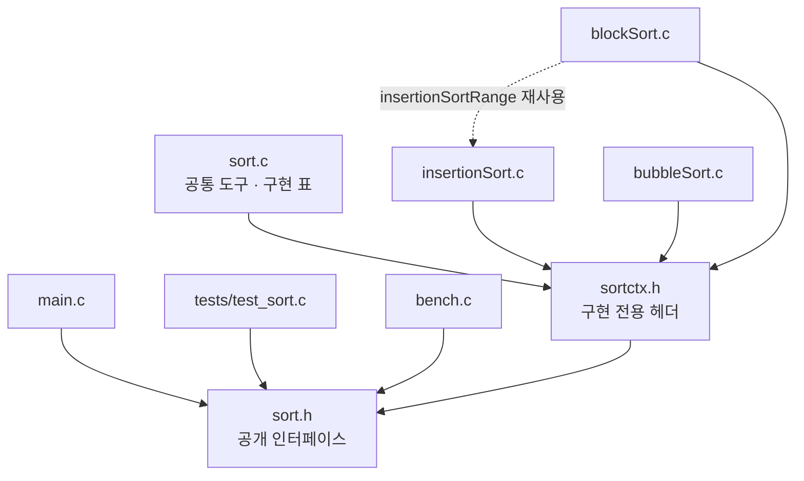

| 파일 | 맡은 것 |
| --- | --- |
| `sort.h` | 바깥에 보이는 인터페이스 (`SortAlgorithm`, `SortStats`, `SortCompare`) |
| `sortctx.h` | `SortCtx`와 `sortSwap` 등 구현끼리만 쓰는 도구 |
| `sort.c` | 그 도구의 구현 + `SORT_ALGORITHMS` 표 |
| `insertionSort.c` · `bubbleSort.c` · `blockSort.c` | 알고리즘 하나씩 |
| `bench.c` | 시간 · 안정성 측정 (알고리즘은 자기가 측정당하는 줄 모른다) |
| `main.c` | 비교 표 출력. `--csv`를 주면 같은 측정을 CSV로 찍는다 |
| `tools/svgchart.py` · `tools/plot.py` | 그 CSV로 그래프(SVG)를 그린다. 표준 모듈만 쓴다 |
| `report/` | 보고서 · 인터랙티브 데모 · 그래프(SVG)와 측정값 원본 |

`sortctx.h`에 드러난 이름은 파일 밖에서도 보이므로 `sortSwap`,
`sortCompareAt`처럼 `sort-`를 붙였다. 한 파일에서만 쓰는
`rotateRange`·`mergeInPlace` 같은 것은 `static`으로 감췄다.

#### 공통 도구

세 구현이 똑같이 쓰는 것은 `SortCtx` 하나로 묶었다.

```c
/* src/sortctx.h */
typedef struct SortCtx {
    char *base;        /* 배열의 첫 바이트 */
    size_t size;       /* 원소 한 개의 바이트 수 */
    SortCompare cmp;
    SortStats *stats;
    char *tmp;         /* 원소 한 칸. 추가로 잡는 메모리는 이것뿐이다 */
} SortCtx;
```

원소 타입을 모르므로 교환도 바이트 단위다. `sortSwap` 한 번이 **이동 3회**이고,
이 숫자가 뒤 결과표에서 버블 정렬을 무겁게 만든다.

### 1.3 검증

구현이 맞는지 어떻게 확인했나. 테스트도 구현 표를 훑으므로, 정렬을 하나 더 넣으면
그 순간부터 같은 검사를 받는다.

```console
$ make test
...
42 checks, 0 failures
```

정렬마다 같은 검사를 돌린다(표를 훑으므로 자동이다).

| 검사 | 내용 |
| --- | --- |
| 기본 케이스 | 섞임 · 정렬됨 · 역순 · 중복 · 모두 같은 값 · 원소 1개 · 빈 배열 |
| `qsort` 대조 | 난수 500개를 표준 라이브러리 결과와 맞춰 본다 |
| 크기 훑기 | `n = 0..200` 전부. 2의 거듭제곱이 아닌 크기에서 블록 · 병합 경계가 깨지기 쉽다 |
| 안정성 | `tag` 순서 실측이 구현 표의 `stable` 값과 일치하는지 |
| 측정 도구 | `makeInput`이 만든 입력 모양, 안정성 판정기가 위반을 잡는지 |

**테스트가 실제로 잡는지도 확인했다(변이 테스트).** 통과하는 테스트는 아무것도
증명하지 않으므로, 구현을 일부러 망가뜨려 보고 실패하는지 본다.

| 망가뜨린 곳 | 결과 |
| --- | --- |
| 삽입 정렬의 `>` → `>=` (안정성만 깨짐) | 검사 **6개** 실패 — 삽입 3개 + 블록 3개(같은 함수를 쓴다) |
| 제자리 병합의 `>=` → `>` (종료 조건) | `assert(newMid > lo)`가 즉시 걸린다 |

둘째 것은 원래 **테스트가 멈춰 버려** 진단이 나오지 않았다. 그래서 진행 보장을
`assert`로 코드에 박아, 무한 재귀 대신 이름 붙은 실패가 나오게 했다.

이와 별도로 **ASan · UBSan**을 붙여 돌려 경고가 없음을 확인했다. 바이트 단위
포인터 산술을 쓰므로 이 확인이 필요하다.

```sh
gcc -std=c17 -Wall -Wextra -g -O1 -fsanitize=address,undefined -Isrc \
    -o asan.out tests/test_sort.c src/sort.c src/insertionSort.c \
    src/bubbleSort.c src/blockSort.c src/bench.c && ./asan.out
```

---

## 2. 알고리즘 상세

세 정렬이 실제로 어떻게 도는지. 그림은 배열이 한 걸음마다 어떻게 바뀌는지를 따라간다.

### 2.1 삽입 정렬

앞쪽을 정렬된 상태로 유지하며 원소를 하나씩 끼워 넣는다.

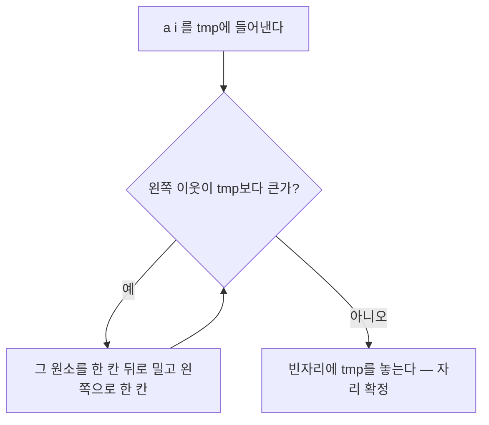

핵심은 조건이 `>`라는 것이다. **같은 값을 만나면 넘지 않고 멈춘다.** 이 한
글자가 안정성을 만든다.

```c
while (j > lo && sortCompareTmp(c, j - 1) > 0) {   /* '>=' 이면 불안정해진다 */
    sortMove(c, sortElemAt(c, j), sortElemAt(c, j - 1));
    j--;
}
```

시작 부분에 `이미 제자리면 건너뛴다` 검사를 두었다. 덕분에 정렬된 입력에서는
비교 `n-1`번, 이동 0번으로 끝난다(결과표의 `[정렬됨]` 행).

### 2.2 버블 정렬

이웃한 두 원소를 견주며 큰 값을 뒤로 밀어낸다.

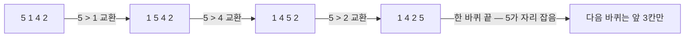

한 바퀴 동안 교환이 하나도 없으면 멈춘다. 그래서 정렬된 입력은 삽입 정렬과
똑같이 `n-1`번 비교로 끝난다.

역순에서는 비교 횟수가 삽입 정렬과 거의 같은데 **이동이 3배다.** 삽입 정렬은 한
칸씩 밀어내므로 이동 1회지만, 버블 정렬의 교환은 `tmp`를 거쳐 이동 3회이기
때문이다.

다른 입력에서는 **비교도 2배쯤 더 한다.** 삽입 정렬은 끼워 넣을 자리를 찾으면
거기서 멈추지만, 버블 정렬은 한 바퀴를 늘 끝까지 세기 때문이다(무작위 입력에서
`7,997,922` 대 `3,950,647`). 셋 중 가장 느린 이유가 이것이다.

### 2.3 블록 정렬

> 📐 **[한 걸음씩 보기 — 인터랙티브 데모](block_sort.html)**
> 무작위 숫자가 정렬되는 과정을 한 단계씩 따라갈 수 있다. 회전이 왜 뒤집기 세
> 번인지, 제자리 병합이 어떻게 문제를 쪼개는지는 글보다 그쪽이 빠르다. 블록
> 크기도 구현과 같은 32를 쓴다 — 그래서 원소가 33개 이상이어야 병합이 돈다.
> (브라우저로 `report/block_sort.html`을 열면 된다. 설치할 것은 없다.)

작은 블록으로 잘라 각각 정렬한 뒤, 덩어리를 배로 넓혀 가며 병합한다.
블록 크기는 **32 상수**다. `n`을 따라가지 않는다 — 왜 그런지는
[블록 크기는 얼마가 좋은가](#블록-크기는-얼마가-좋은가)에서 재 보았다.

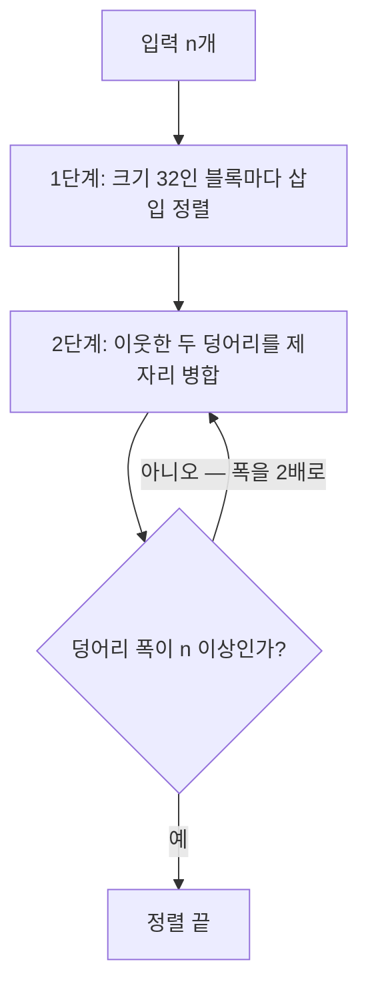

병합 정렬과 다른 점은 **보조 배열을 쓰지 않는다**는 것이다. 대신 원소 덩어리를
**회전(rotation)** 으로 통째로 옮긴다. 회전은 뒤집기 세 번이면 된다.

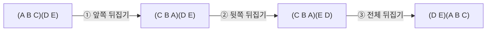

**뒤집기는 두 번 하면 제자리로 돌아온다.** 두 덩어리를 각각 뒤집어 둔 뒤 전체를
한 번 더 뒤집으면, 각 덩어리는 두 번 뒤집혀 순서가 복원되고 **덩어리끼리의 앞뒤만**
바뀐다. 중간의 ①②는 배열을 망가뜨린 것처럼 보이지만 ③까지 가야 뜻이 생긴다.

보조 배열이 있었다면 한쪽을 복사해 두고 밀면 끝날 일이다. 그것을 쓰지 않는 것이
블록 정렬의 존재 이유이므로, 이 회전이 제자리 병합의 유일한 도구가 된다.
회전에 드는 추가 메모리는 교환이 거쳐 가는 원소 한 칸(`tmp`)뿐이고, `n`을 따라
늘지 않는다.

제자리 병합은 이렇게 돈다.

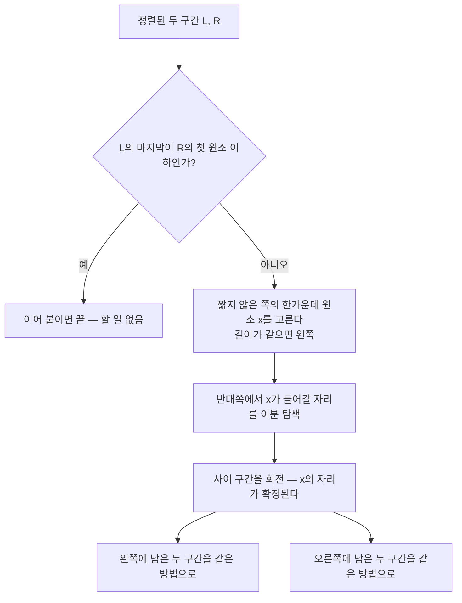

**길이가 같으면 왼쪽을 고른다.** 조건이 `>` 가 아니라 `>=` 인 것이 그냥 취향이
아니다. 같을 때 오른쪽으로 보내면, 두 런이 **모두 길이 1**인 경우 고를 자리가
`mid` 그 자체가 되어 회전할 구간이 비고, 같은 인자로 다시 불려 **무한 재귀**가
된다. 왼쪽으로 보내면 그 경우에 고르는 자리가 곧 `a[mid-1]`이고, 바로 앞의
이어붙이기 검사에서 `a[mid-1] > a[mid]`임이 이미 확인됐으므로 `lowerBound`가
`mid` 너머를 돌려준다 — 회전이 비지 않는다.

런이 더 길면 회전이 비는 일 자체는 있다(무작위 `n = 4,000`에서 왼쪽을 고른
10,464번 중 748번). 그래도 멈추는 이유는 따로 있다. 고른 자리가 `lo`보다 뒤라
다음 재귀가 반드시 짧아지는 것이고, 실제로 성립하는 불변식은 `newMid > lo`다.
코드가 `assert`로 박아 둔 것이 바로 그 조건이다.

블록 둘을 병합할 때는 **길이가 같은 쪽이 오히려 기본**이라(블록 크기가 32 상수다),
이 한 글자가 늘 일하고 있다.

**안정성은 이분 탐색을 무엇으로 하느냐에 달렸다.**

| 한가운데를 고른 쪽 | 쓰는 탐색 | 왜 |
| --- | --- | --- |
| 왼쪽 구간 | `lowerBound` (그 값 **이상**이 처음 나오는 자리) | 오른쪽의 같은 값은 뒤에 남아야 한다 |
| 오른쪽 구간 | `upperBound` (그 값 **초과**가 처음 나오는 자리) | 왼쪽의 같은 값은 앞에 남아야 한다 |

둘을 바꿔 쓰면 정렬 결과는 멀쩡한데 안정성만 조용히 깨진다. 유닛 테스트가
이것을 잡는다.

> **이 구현은 수업용으로 줄인 판이다.** 실제 block sort(WikiSort)는 배열 안에
> 내부 버퍼를 잡아 병합을 `O(n log n)`까지 끌어내린다. 여기서는 회전 병합만
> 써서 `O(n log^2 n)`이다. 대신 200줄이 아니라 파일 하나로 읽힌다.

---

## 3. 알고리즘 실험

같은 잣대로 재고 그래프로 견준 결과.

### 3.1 실험 개요

무엇을 어떤 조건으로 쟀는지, 그리고 '안정성'처럼 눈에 보이지 않는 성질을 어떻게
숫자로 만들었는지.

#### 무엇을 어떻게 쟀나

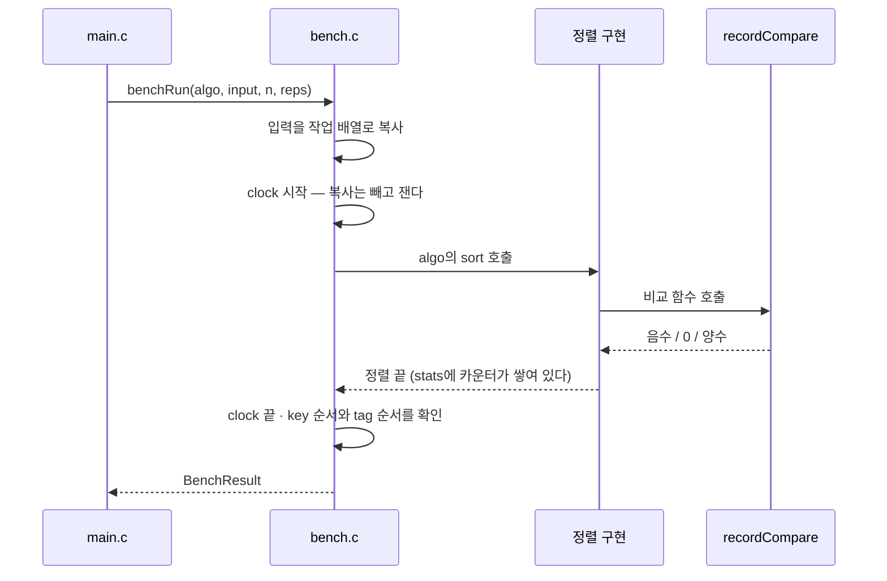

| 재는 것 | 방법 | 주의 |
| --- | --- | --- |
| 시간 | `clock()`, 복사를 뺀 구간, `reps`회 평균 | 기계 · 부하에 흔들린다. **같은 표 안에서만** 견줄 것 |
| 비교 · 이동 | 구현이 `SortStats`에 센다 | 재현된다. 보고서에는 이쪽이 더 믿을 만하다 |
| 메모리 | `extraBytes` — 입력 배열 밖에 잡은 최대 바이트 | 셋 다 `tmp` 한 칸뿐이다 |
| 재귀 깊이 | `maxDepth` — 실제로 들어간 최대 깊이 | 스택 사용량의 대리 지표 |
| 안정성 | `tag` 순서 실측 | 표의 `stable` 값은 **주장**일 뿐이다 |

입력은 네 모양으로 만든다: 무작위 · 정렬됨 · 역순 · 중복많음. 씨앗을 고정해
매번 같은 입력을 쓴다.

무엇을 잴지는 `main.c`의 `SPECS` 배열 한 곳에만 적혀 있고, 결과를 표로 찍을지
CSV로 찍을지는 함수 포인터(`RowSink`)로 갈아 끼운다. 정렬을 갈아 끼운 것과 같은
수다. 덕분에 그래프를 그리는 스크립트가 **사람이 읽는 표를 파싱하지 않아도 된다.**

```sh
make run                # 사람이 읽는 표
./src/main.out --csv    # 같은 측정을 CSV로
make charts             # 그 CSV로 report/ 아래에 그래프를 그린다
```

#### 안정성은 어떻게 쟀나

`int` 배열로는 안정성을 볼 수 없다. `3`과 `3`은 구별되지 않기 때문이다. 그래서
원소를 두 칸짜리로 만들었다.

```c
/* src/bench.h */
typedef struct Record {
    int key;   /* 정렬 기준 */
    int tag;   /* 입력에서의 순서를 새겨 둔다 */
} Record;
```

`recordCompare`는 **`key`만** 본다(`tag`까지 넣으면 모든 정렬이 안정해 보인다).
정렬이 끝난 뒤 같은 `key`끼리 `tag`가 오름차순이면 안정 정렬이다.

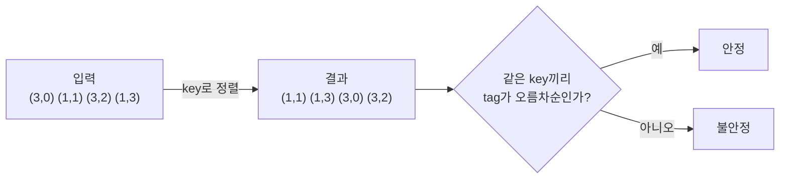

이것이 가능한 이유는 인터페이스가 `void *`와 비교 함수를 받기 때문이다. 정렬
코드는 `Record`를 전혀 모르는 채로 정렬한다.

유닛 테스트는 실측 결과가 **구현 표의 `stable` 값과 일치하는지**를 본다. 표에
`stable`이라 적어 두고 구현이 안 지키면 실패한다.

실제로 삽입 정렬의 `>`를 `>=`로 한 글자만 바꿔 보면 검사 **6개**가 무너진다.
삽입 정렬에서 3개, **블록 정렬에서 3개**다. 블록 정렬이 블록을 정리할 때 같은
`insertionSortRange`를 쓰기 때문이다. 이때도 결과는 여전히 오름차순으로
정렬되어 있다 — 안정성 검사가 없었다면 아무도 눈치채지 못했을 것이다.

### 3.2 실험 결과

`make run`의 출력이다. 같은 컨테이너, `-O2`. 아래 표와 그래프는 **한 번의 같은
실행**에서 나왔고, 그때의 측정값은 [`results.csv`](results.csv)에 남겼다.
`make charts`를 다시 돌리면 새로 재므로 **시간은 조금씩 달라진다.** 비교·이동
횟수는 입력이 고정이라 언제 돌려도 같은 값이 나온다 — 보고서가 그 숫자를 앞세우는
이유이기도 하다.

> 그래프는 `make charts`로 만든다. 이 저장소는 외부 라이브러리를 쓰지 않으므로
> (matplotlib이 없다) [`tools/svgchart.py`](../tools/svgchart.py)가 표준 모듈만으로 SVG를
> 직접 찍는다.

#### 축을 두 벌 그린 이유

같은 자료를 **선형 축과 로그 축으로 각각** 그렸다. 하나로는 절반씩 놓치기 때문이다.

| 축 | 잘 보여 주는 것 | 감추는 것 |
| --- | --- | --- |
| 선형 | 격차의 **크기**. 막대 높이가 곧 값의 비율이다 | 작은 값. 바닥에 붙어 사라진다 |
| 로그 | 작은 값과 **자라는 속도**(기울기 = 복잡도 지수) | 격차의 크기. 눈금 한 칸이 10배다 |

아래는 선형을 먼저 놓고 같은 자료를 로그로 한 번 더 놓는다.

#### 입력 모양별 (n = 4,000, 3회 평균)

| 입력 | 알고리즘 | 시간(ms) | 비교 | 이동 | 재귀깊이 |
| --- | --- | ---: | ---: | ---: | ---: |
| 무작위 | insertionSort | 10.852 | 3,950,647 | 3,950,655 | 1 |
| 무작위 | bubbleSort | 28.344 | 7,997,922 | 11,828,007 | 1 |
| 무작위 | **blockSort** | **0.674** | **91,071** | 346,417 | 16 |
| 정렬됨 | insertionSort | 0.003 | 3,999 | 0 | 1 |
| 정렬됨 | bubbleSort | 0.005 | 3,999 | 0 | 1 |
| 정렬됨 | blockSort | 0.004 | 3,999 | 0 | 1 |
| 역순 | insertionSort | 20.764 | 8,001,999 | 8,005,998 | 1 |
| 역순 | bubbleSort | 29.902 | 7,998,000 | 23,994,000 | 1 |
| 역순 | **blockSort** | **0.433** | **72,905** | 276,198 | 24 |
| 중복많음 | insertionSort | 9.273 | 3,575,497 | 3,575,032 | 1 |
| 중복많음 | bubbleSort | 27.483 | 7,867,695 | 10,703,898 | 1 |
| 중복많음 | **blockSort** | **0.394** | **52,381** | 233,568 | 21 |

##### 걸린 시간

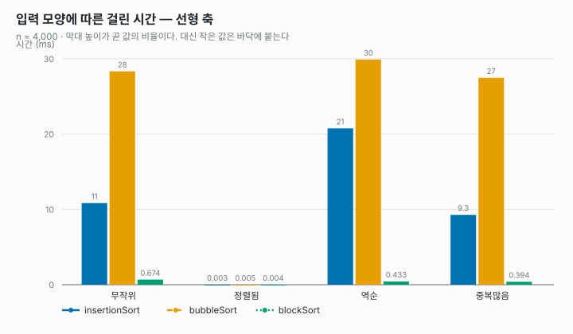

- **이것이 실제 격차다.** 버블 정렬만 우뚝하고, 블록 정렬은 바닥의 선으로만 남는다.
- `정렬됨` 묶음에는 막대가 보이지 않는다. 셋 다 0.003ms 언저리라 높이가 없다.
  조기 종료가 셋 다 걸리기 때문이다. **정렬의 성능은 입력을 빼고 말할 수 없다.**

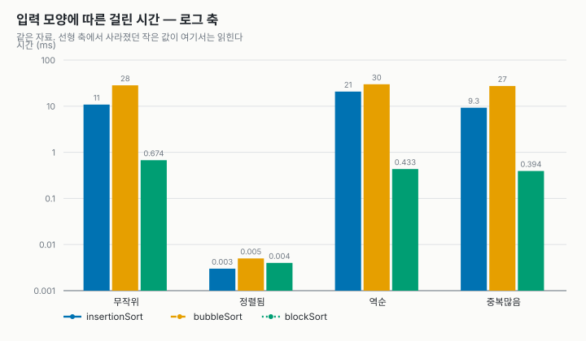

- 같은 자료다. 로그 축에서는 0.004ms도 자기 높이를 갖는다.
- 블록 정렬이 `정렬됨`을 빼면 세 묶음에서 거의 같은 높이(0.394~0.674ms)라는 것도
  여기서 읽힌다. 입력 모양을 타지 않는다는 뜻이고, 최악을 감당해야 하는 코드가 원하는 성질이다.
- 대신 위 선형 그래프의 압도적인 차이가 눈금 네 칸 남짓으로 눌려 보인다. 눈금 한 칸이
  10배이기 때문이다. 로그 축이 주는 것이자 가져가는 것이다.

##### 비교 횟수

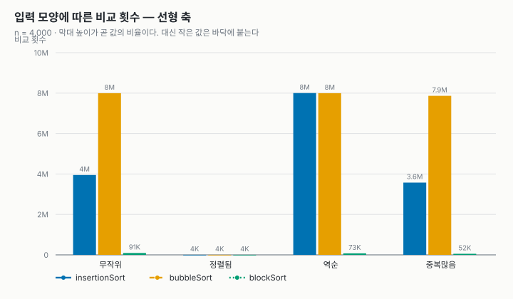

- **역순이 `O(n^2)` 둘의 최악이다.** 삽입 정렬의 비교가 `8,001,999`로 이론값
  `n^2/2 = 8,000,000`과 맞는다.
- 블록 정렬 막대는 네 묶음 모두 선형 축에서 사실상 보이지 않는다. 그것이 답이다.

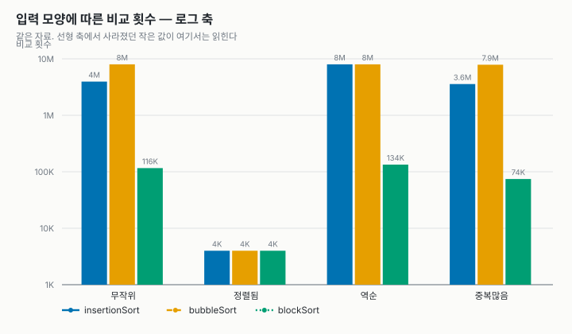

- 로그 축에서야 `정렬됨`의 `3,999`(= n-1)과 블록 정렬의 자릿수가 읽힌다.
- **블록 정렬은 중복이 많으면 오히려 빨라진다.** 조기 종료가 더 자주 걸린다.

##### 이동 횟수

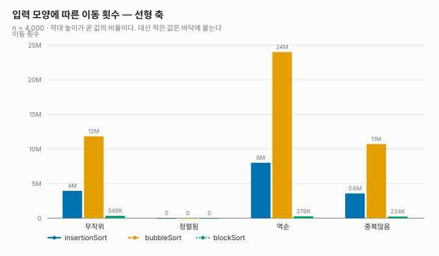

- 버블 정렬이 역순에서 `23,994,000`회로 혼자 치솟는다.
- `정렬됨`은 0회다. 셋 다 한 원소도 옮기지 않는다.

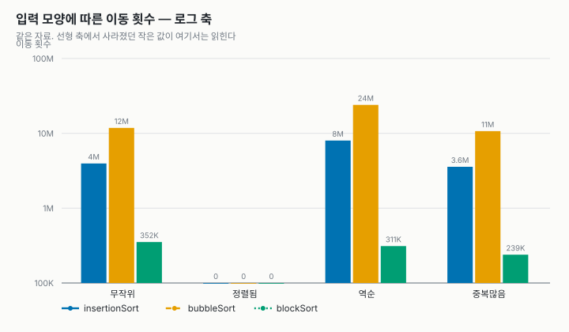

- 로그 축에서도 `정렬됨`에는 막대가 없다. 0은 로그 축에 놓을 자리가 없다 —
  없는 것과 작은 것은 다르다.

두 그래프를 겹쳐 보면 버블 정렬이 지는 이유가 한 장에 들어온다.

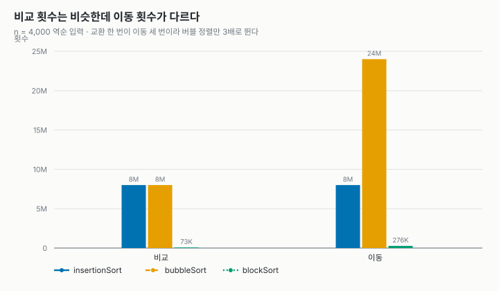

역순에서 둘의 비교 횟수는 `8,001,999` 대 `7,998,000`로 거의 같다.
그런데 이동은 버블 정렬이 `23,994,000`회, 비교 횟수의 정확히 3배다. 매 비교가
교환으로 이어지고 교환 하나가 `tmp`를 거쳐 이동 3회이기 때문이다. 시간이 삽입 정렬의
1.4배인 이유가 여기 있다.

##### 재귀 깊이

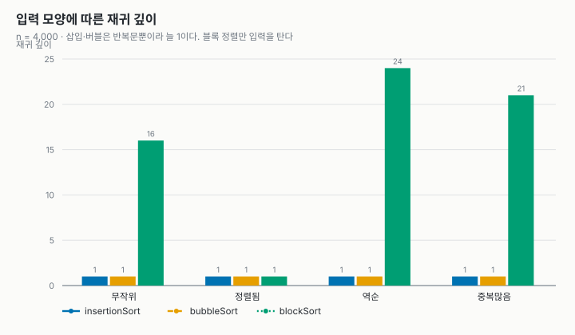

값이 1~24라 로그 축이 필요 없다. 선형 하나로 족하다.

- 삽입·버블은 반복문뿐이라 **어떤 입력에서도 1**이다.
- 블록 정렬만 입력을 탄다. `정렬됨`에서는 1(병합이 즉시 끝난다), 역순에서는 24까지 간다.
- 이 열이 블록 정렬이 치른 값이다. 메모리가 셋 다 8 B로 같은 대신, 스택은 여기로 나간다.

#### n을 키우며 (무작위)

| n | insertion 비교 | 배수 | bubble 비교 | 배수 | block 비교 | 배수 |
| ---: | ---: | ---: | ---: | ---: | ---: | ---: |
| 1,000 | 255,273 | — | 499,094 | — | 18,762 | — |
| 2,000 | 998,714 | ×3.91 | 1,998,945 | ×4.01 | 41,487 | ×2.21 |
| 4,000 | 3,950,647 | ×3.96 | 7,997,922 | ×4.00 | 91,071 | ×2.20 |
| 8,000 | 15,966,683 | ×4.04 | 31,982,470 | ×4.00 | 197,670 | ×2.17 |

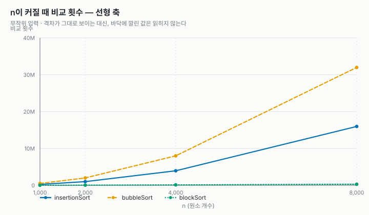

- 삽입·버블은 위로 휘어 오르고, 블록 정렬은 바닥에 붙어 거의 평평하다.
- `n`이 두 배가 될 때마다 간격이 네 배로 벌어진다. 표의 `×3.96`, `×4.04`가 이 휘어짐이다.

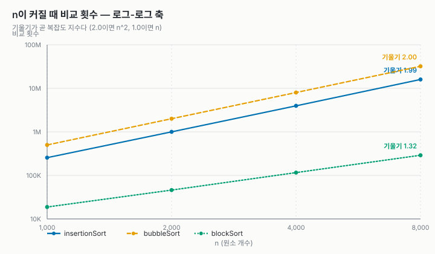

- 로그-로그에서는 셋 다 **직선**이 되고, **기울기가 곧 복잡도 지수**가 된다.
- 삽입 `1.99`, 버블 `2.00` — `O(n^2)`의 지수 2를 축에서 바로 읽는다.
- 블록 정렬은 `1.13`이다. 같은 구간에서 `n log n`의 기울기가 `1.13`이니,
  **이 범위에서는 `n log n`과 구별되지 않는다.** 최악은 `O(n log^2 n)`이지만 `log^2` 항은
  병합 단계가 더 쌓여야, 곧 `n`이 훨씬 커져야 드러난다.

| n | insertion(ms) | bubble(ms) | block(ms) |
| ---: | ---: | ---: | ---: |
| 1,000 | 0.674 | 1.751 | 0.136 |
| 2,000 | 2.802 | 6.815 | 0.327 |
| 4,000 | 10.694 | 29.407 | 0.731 |
| 8,000 | 44.282 | 125.844 | 1.691 |

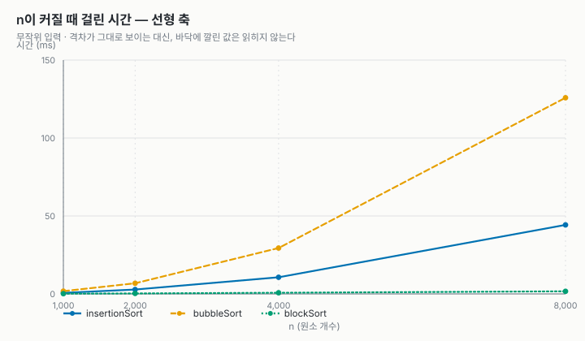

`n = 8,000`에서 블록 정렬은 버블 정렬보다 **74배** 빠르다.
그래프에서 블록 정렬 선이 x축과 구별되지 않는 것이 그 배수다.

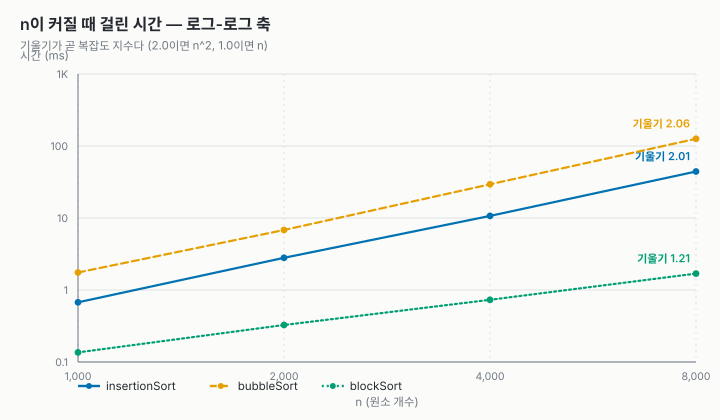

시간도 비교 횟수와 같은 모양으로 자란다. 다만 기울기가 그만큼 매끈하지 않은데, 캐시와
스케줄러가 끼어들기 때문이다. **그래서 보고서는 비교·이동 횟수를 함께 싣는다.**


#### 블록 크기는 얼마가 좋은가

1단계가 블록을 얼마나 크게 자를지는 고를 수 있는 값이다. 처음에는 진짜 block
sort(WikiSort)를 따라 `ceil(√n)`을 썼는데, 재 보니 그 값이 아니었다.

| 블록 | n = 1,000 | n = 4,000 | n = 16,000 | n = 64,000 |
| ---: | ---: | ---: | ---: | ---: |
| 2 | 15,944 | 79,449 | 379,694 | 1,770,361 |
| 4 | 15,766 | 78,821 | 377,156 | 1,759,799 |
| 8 | 15,652 | 78,583 | 376,247 | 1,756,430 |
| 16 | 16,141 | 81,096 | 386,459 | 1,797,877 |
| 24 | 17,296 | 84,820 | 402,430 | 1,865,138 |
| **32** | 18,762 | 91,071 | 426,120 | 1,953,003 |
| 48 | 21,579 | 101,519 | 471,069 | 2,140,801 |
| 64 | 24,635 | 115,971 | 525,034 | 2,353,442 |
| 96 | 31,908 | 142,269 | 634,152 | 2,788,281 |
| 128 | 39,019 | 173,183 | 750,054 | 3,258,819 |
| 192 | 52,129 | 226,629 | 978,752 | 4,197,539 |
| 256 | 69,889 | 292,811 | 1,233,135 | 5,185,576 |
| 512 | 131,962 | 537,949 | 2,214,505 | 9,137,682 |
| 1024 | — | 1,033,289 | 4,182,405 | 17,096,623 |

표의 값은 비교 횟수다(입력이 고정이라 재현된다). `n`보다 큰 블록은 재지 않는다 —
배열 전체가 블록 하나가 되어 그냥 삽입 정렬이기 때문이다. 아래 그래프는 `n = 1,000`에
짝이 없는 1024를 빼고 512까지만 그린다.

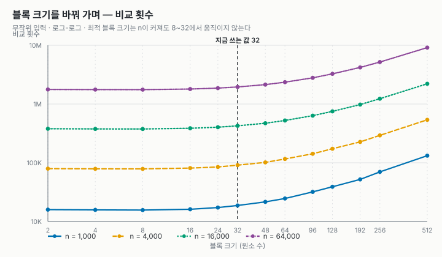

**최적은 `n`을 따라가지 않는다.** `n`이 1,000이든 64,000이든 가장 낮은 자리는 블록
8이고, 2~16 구간은 그 언저리에서 3% 남짓으로 평평하다. 32까지는 11~20% 완만하게
오르고, 그 뒤로는 곧장 치솟는다 — `n = 64,000`에서 1024는 최저의 9.7배다.

이유는 두 항의 모양이 다르기 때문이다.

| 항 | 비용 | 블록 크기 `B`를 키우면 |
| --- | --- | --- |
| 1단계 · 블록마다 삽입 정렬 | `O(B²)` × `n/B`개 = **`O(n·B)`** | **정비례로 늘어난다** |
| 2단계 · 제자리 병합 | 대략 `O(n·log²(n/B))` | log 수준으로만 줄어든다 |

늘어나는 쪽이 정비례라 금세 이긴다. 그래서 최적 `B`는 `n`과 무관한 작은 상수다.
timsort가 minrun을 32~64로 잡는 것도 같은 계산이다.

`ceil(√n)`이 나쁜 값이 된 것은 그것이 **다른 용도의 수**이기 때문이다. WikiSort에서
`√n`은 초기 블록의 길이가 아니라 **배열 안에 잡는 내부 버퍼의 크기**다. 이 구현은 그
버퍼를 쓰지 않으므로 `√n`을 따를 이유가 없었다. 빌려온 상수를 근거 없이 쓴 탓에
`n = 64,000`에서 비교를 **2.6배** 더 쓰고 있었다 — `ceil(√64000)` = 253으로 재면
`5,150,756`회, 지금의 32로는 `1,953,003`회다.

지금은 **32 상수**를 쓴다(`src/blockSort.c`의 `blockSortBlockSize`). 8이 비교는 11~20%
적지만 이동이 더 많아 시간은 비슷하고(`n = 64,000`에서 19.6ms 대 19.2ms), 32는 완만한
구간의 끝이라 블록을 조금 잘못 잡아도 손해가 적다.

> 이 표는 `./src/main.out --blocks`가 찍은 [`block-size.csv`](block-size.csv)에서 나왔다.
> 실험이 블록 크기를 바꿔 넣을 수 있도록 `blockSortBlockSize`는 `const`가 아니다.

#### 메모리와 안정성

| 알고리즘 | 추가 메모리 | 재귀 깊이 (n=8,000) | 안정성(실측) |
| --- | ---: | ---: | :---: |
| insertionSort | 8 B | 1 | 안정 |
| bubbleSort | 8 B | 1 | 안정 |
| blockSort | 8 B | 18 | 안정 |

**셋 다 8바이트로 같다.** 원소 한 칸(`Record` 하나)이 전부다. 이게 밋밋한
결과로 보이지만, 사실 이 표의 결론이다. 그래프로 그릴 것이 없다는 것 자체가 결과다.

- 일반적인 병합 정렬이었다면 `O(n)` = 64,000바이트가 들었을 자리다.
- 블록 정렬은 **그 8바이트를 지킨 채** 비교 횟수를 `O(n^2)`에서 끌어내렸다.
  이것이 블록 정렬의 존재 이유다.
- 공짜는 아니다. 값을 치른 곳이 **재귀 깊이** 열이다. 깊이 18이면 스택 프레임
  18개를 쓴다. `O(1)`이라고 할 때 스택은 세지 않았다는 뜻이기도 하다.

### 3.3 한계

- **블록 정렬이 줄인 판이다.** 내부 버퍼를 쓰지 않아 `O(n log^2 n)`이다. 진짜
  `O(n log n)`을 보려면 WikiSort를 봐야 한다.
- **`O(1)` 메모리에 스택은 안 세었다.** 제자리 병합의 재귀가 `O(log n)` 깊이다.
  반복문과 명시적 스택으로 바꾸면 그 몫까지 `extraBytes`로 잴 수 있다.
- **시간은 기계 하나에서 잰 값이다.** 다른 기계 · 다른 최적화 수준에서는 달라진다.
  비교 · 이동 횟수를 함께 보는 이유다.
- **`rand()`로 입력을 만든다.** 씨앗은 고정했지만 분포는 표준 라이브러리에
  맡겼다.
- 셋 다 안정 정렬이라 **불안정한 정렬과의 대조가 없다.** 선택 정렬이나 퀵
  정렬을 표에 한 줄 더 넣으면 `stable` 열이 비로소 갈린다.
